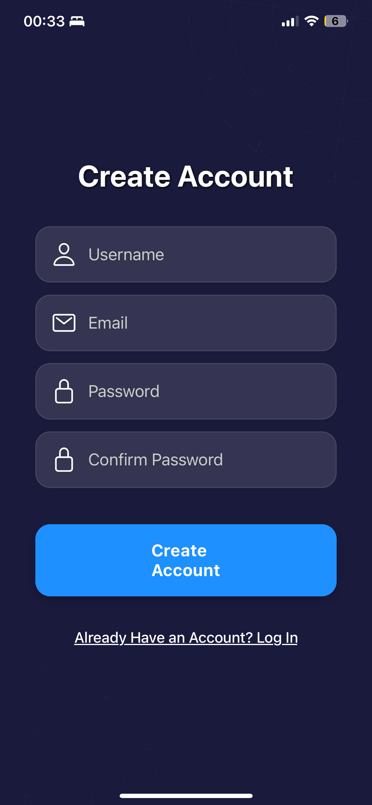
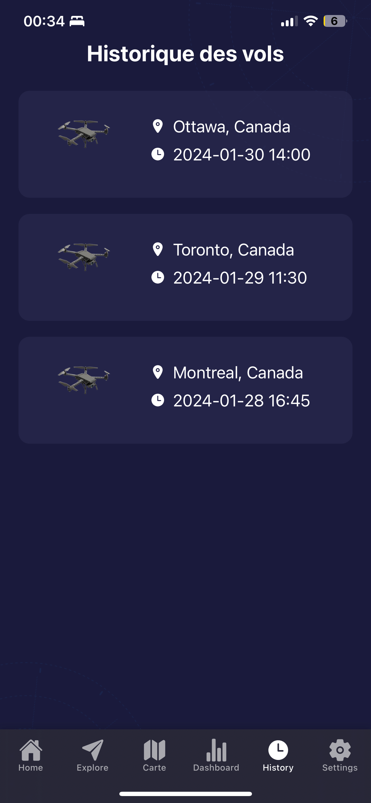
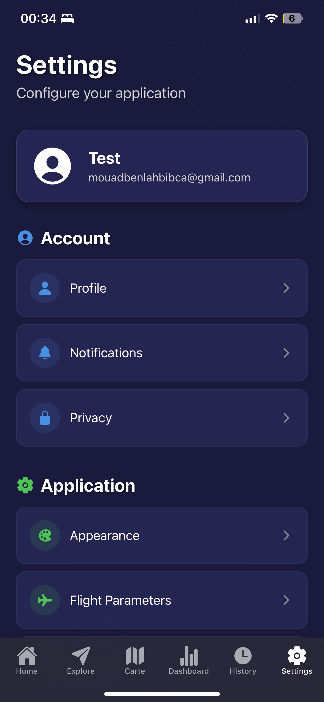
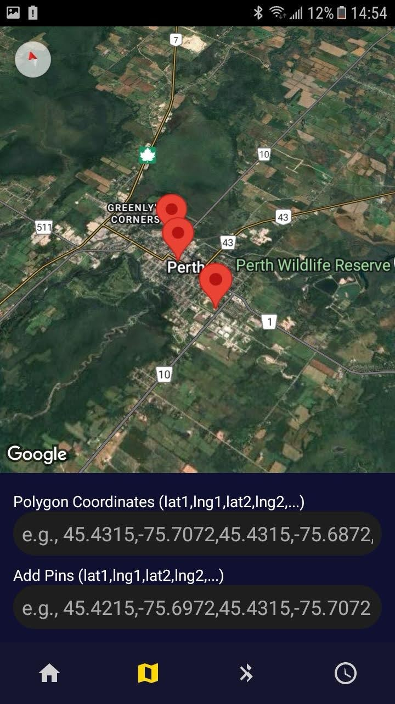

# TAILS Mobile App

Mobile applications for the **TAILS** capstone project.

This repository contains **two separate mobile projects**:
- **`MobileApp-ExpoGo-UI/`** : Expo / React Native UI app
- **`MobileApp-AndroidStudio-BLE/`** : Native Android BLE app (plus ESP32 test server sample)

---

## Repository Structure

```text
MobileApp/
├── MobileApp-ExpoGo-UI/            # Expo (React Native) UI app
├── MobileApp-AndroidStudio-BLE/    # Android Studio BLE app
└── docs/
    └── images/                     # Screenshots used in this README
```

---

## Tech Stack

### `MobileApp-ExpoGo-UI` (Expo UI)
- Expo / React Native
- `expo-linear-gradient`

### `MobileApp-AndroidStudio-BLE` (Android BLE)
- Native Android
- Bluetooth Low Energy (BLE)
- Google Maps SDK

---

## Screenshots

<table>
  <tr>
    <td width="50%" align="center">
      <strong>Login</strong><br/>
      
    </td>
    <td width="50%" align="center">
      <strong>Create Account</strong><br/>
      
    </td>
  </tr>

  <tr>
    <td width="50%" align="center">
      <strong>Home (iOS)</strong><br/>
      
    </td>
    <td width="50%" align="center">
      <strong>Home (Android)</strong><br/>
      
    </td>
  </tr>

  <tr>
    <td width="50%" align="center">
      <strong>History</strong><br/>
      
    </td>
    <td width="50%" align="center">
      <strong>Settings</strong><br/>
      
    </td>
  </tr>
</table>

<br/>

<div align="center">
  <strong>Map / POI</strong><br/>
  
</div>

---

## Getting Started

### Expo UI App (`MobileApp-ExpoGo-UI/`)

```bash
cd MobileApp-ExpoGo-UI
npm install
npx expo start
```

### Android BLE App (`MobileApp-AndroidStudio-BLE/`)

1. Open `MobileApp-AndroidStudio-BLE/` in Android Studio
2. Sync Gradle
3. Build & run on an Android device

---

## License

MIT License. See `LICENSE`.
