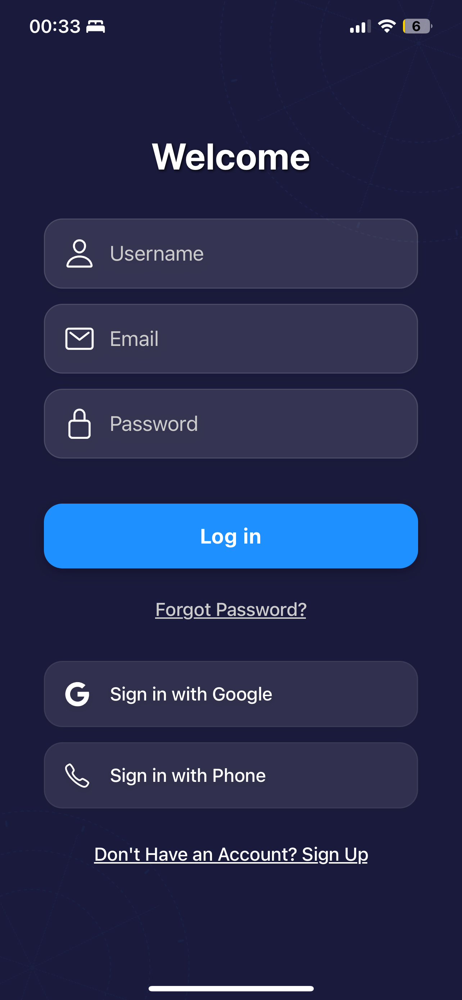
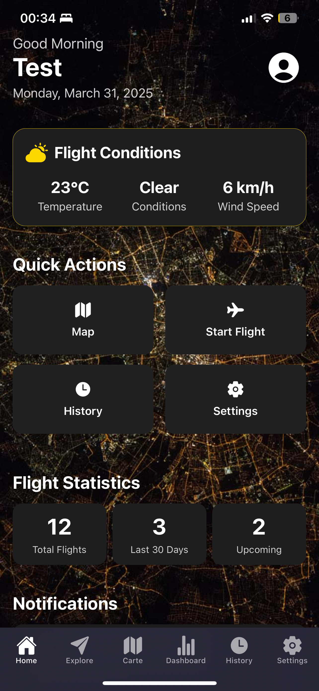
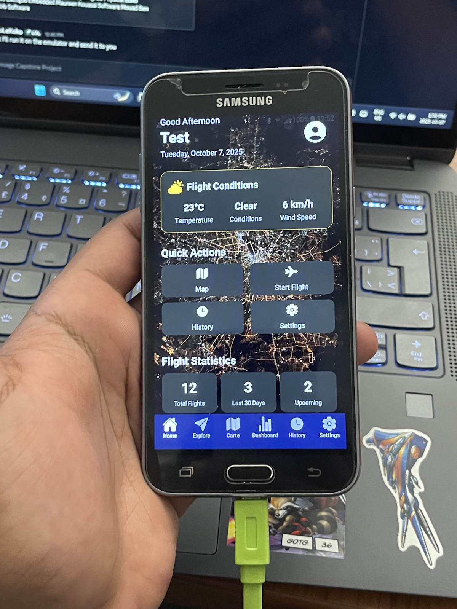

# TAILS MobileApp

This repository is a **monorepo-style container** for the TAILS mobile application work.

> The **repo root currently contains only subfolders** (there is **no root-level Gradle or Node project** to build/run from the top). Please follow the instructions in each subproject’s README.

## Screenshots / UI Preview

### Auth & Home

  
  
  
  

### Map / POI Pinning

  

## Subprojects

This repo contains multiple subprojects. For setup, build, run, and environment details, see their READMEs:

- **Mobile App** (client)
  - 📄 **README:** see the subproject README in the corresponding folder (linked below).
- **Backend / Services** (if applicable)
  - 📄 **README:** see the subproject README in the corresponding folder (linked below).

### Subproject README links

- Mobile app subproject README: `./mobile/README.md` *(update this link if your folder name differs)*
- Backend/services subproject README: `./backend/README.md` *(update this link if your folder name differs)*

> If those paths don’t match your current folder names, please open an issue/PR or update this README with the correct subproject folder paths.

## Repository layout (high level)

- `docs/images/` — committed screenshots referenced above
- Other folders at the repo root — individual subprojects (each should include its own README)

## Contributing

- Make changes within the relevant subproject folder.
- Keep subproject documentation in the subproject README, and link to it from this root README.
